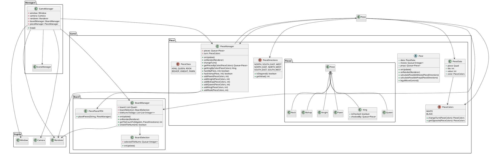

# Call Graph Diagram Generation Guide

This guide explains how to generate call-graph diagrams for the Chess4You project for your integration testing homework.

## Method 1: IntelliJ IDEA (Recommended - Easiest)

### Steps:
1. Open the project in IntelliJ IDEA
2. Right-click on the `src/main/java` folder
3. Select **Diagrams → Show Diagram → Java Class Diagram**
4. IntelliJ will generate a UML class diagram showing all classes and their relationships
5. To export:
   - Click on the diagram toolbar
   - Select **Export to file** (camera icon)
   - Choose PNG or SVG format
   - Save as `call-graph-diagram.png`

### For Method Call Graphs:
1. Right-click on a specific class (e.g., `GameManager.java`)
2. Select **Diagrams → Show Diagram for GameManager**
3. Click the **+** button to expand dependencies
4. Show **Method Dependencies** from the dropdown
5. Export the diagram

## Method 2: Gradle Plugin (Automated)

### Using PlantUML Gradle Plugin

The `build.gradle` file has been configured. Run:

```bash
./gradlew generateDiagram
```

This will generate a PlantUML diagram in `build/diagrams/class-diagram.puml`

## Method 3: Online Tool - yWorks

1. Go to https://www.yworks.com/yed-live/
2. Upload your Java source files
3. Select "Hierarchical Layout"
4. Export as PNG

## Method 4: Manual PlantUML

Create a PlantUML file manually based on the architecture:



## Method 5: Command Line with Graphviz

Install Graphviz and use the provided script:

```bash
chmod +x generate-call-graph.sh
./generate-call-graph.sh
```

## Recommended Approach for Homework

**Use IntelliJ IDEA Method** because:
- No additional installation required
- Automatically generates accurate diagrams
- Easy to export to PDF
- Shows both class relationships and method calls
- Widely accepted in academic settings

## Integration Test Call Graph

For the integration tests specifically, create a diagram showing:

1. **GameManager ↔ BoardManager ↔ PieceManager**
2. **PieceManager ↔ Piece ↔ BoardManager**
3. **BoardManager ↔ BoardSelection ↔ PieceManager**

This matches the pair-wise integration testing strategy in `PairWiseIntegrationTest.java`.

## What to Include in Your Report

1. Full project class diagram (all classes)
2. Focused call-graph showing the 3 pairs being tested
3. Method-level call graph for at least one integration test scenario

## Export Format

- **PNG**: For embedding in PDF report
- **SVG**: For high-quality diagrams
- **PDF**: Direct inclusion in report
