# Control Flow Graphs - Mermaid Diagrams
## Homework 2: Basis-Path Testing Flowcharts

---

## Method 1: `hasAlly(Piece piece, int nextTile)`

**Cyclomatic Complexity:** V(G) = 4

### Basis Paths for hasAlly():

**Path 1:** Start → Init → LoopCheck(No) → ReturnFalse → End
- **Test:** Empty pieces list

**Path 2:** Start → Init → LoopCheck(Yes) → TileCheck(No) → LoopCheck(No) → ReturnFalse → End
- **Test:** No matching tile

**Path 3:** Start → Init → LoopCheck(Yes) → TileCheck(Yes) → ColorCheck(No) → LoopCheck(No) → ReturnFalse → End
- **Test:** Matching tile but different color

**Path 4:** Start → Init → LoopCheck(Yes) → TileCheck(Yes) → ColorCheck(Yes) → ReturnTrue → End
- **Test:** Matching tile and same color (ally found)

---

## Method 2: `hasEnemy(Piece piece, int nextTile)`

**Cyclomatic Complexity:** V(G) = 4

### Basis Paths for hasEnemy():

**Path 1:** Start → Init → LoopCheck(No) → ReturnFalse → End
- **Test:** Empty pieces list

**Path 2:** Start → Init → LoopCheck(Yes) → TileCheck(No) → LoopCheck(No) → ReturnFalse → End
- **Test:** No matching tile

**Path 3:** Start → Init → LoopCheck(Yes) → TileCheck(Yes) → ColorCheck(No) → LoopCheck(No) → ReturnFalse → End
- **Test:** Matching tile but same color (ally, not enemy)

**Path 4:** Start → Init → LoopCheck(Yes) → TileCheck(Yes) → ColorCheck(Yes) → ReturnTrue → End
- **Test:** Matching tile and different color (enemy found)

---

## Method 3: `isValidTileNum(int tileNum)`

**Cyclomatic Complexity:** V(G) = 3

### Basis Paths for isValidTileNum():

**Path 1:** Start → Check1(Yes) → ReturnFalse → End
- **Test:** Negative number (tileNum < 0)

**Path 2:** Start → Check1(No) → Check2(Yes) → ReturnFalse → End
- **Test:** Number too large (tileNum > 63)

**Path 3:** Start → Check1(No) → Check2(No) → ReturnTrue → End
- **Test:** Valid range (0 ≤ tileNum ≤ 63)

---

## Alternative View: Combined OR Condition for `isValidTileNum()`

This shows the logical OR condition more explicitly:

---

## Detailed Control Flow Graph with Node Numbers

### Method 1 & 2: hasAlly/hasEnemy (with node labels)

### Cyclomatic Complexity Calculation:
- **V(G) = E - N + 2P**
- E (edges) = 10
- N (nodes) = 8
- P (connected components) = 1
- **V(G) = 10 - 8 + 2(1) = 4** ✓

---

## Method 3: isValidTileNum (with node labels)

### Cyclomatic Complexity Calculation:
- **V(G) = E - N + 2P**
- E (edges) = 6
- N (nodes) = 7
- P (connected components) = 1
- **V(G) = 6 - 7 + 2(1) = 1**
- OR using decision points: **V(G) = 2 + 1 = 3** ✓

---

## State Transition Diagram: Turn Management

---

## Decision Table Visualization

### isValidTileNum() Decision Table

---

## Equivalence Partitioning Diagram

```mermaid
graph LR
    subgraph Invalid_Low[Invalid: x < 0]
        A1[-100]
        A2[-50]
        A3[-1]
    end
    
    subgraph Valid[Valid: 0 ≤ x ≤ 63]
        B1[0]
        B2[32]
        B3[63]
    end
    
    subgraph Invalid_High[Invalid: x > 63]
        C1[64]
        C2[100]
        C3[1000]
    end
    
    Invalid_Low --> Result1[Return FALSE]
    Valid --> Result2[Return TRUE]
    Invalid_High --> Result3[Return FALSE]
    
    style Valid fill:#98FB98
    style Invalid_Low fill:#FFA07A
    style Invalid_High fill:#FFA07A
    style Result2 fill:#90EE90
    style Result1 fill:#FFB6C1
    style Result3 fill:#FFB6C1
```

---

## Boundary Value Analysis Visualization

---

## How to Use These Diagrams

### In Markdown Viewers:
- **GitHub:** Renders Mermaid diagrams automatically
- **VS Code:** Install "Markdown Preview Mermaid Support" extension
- **IntelliJ/IDEA:** Built-in Mermaid support in markdown preview

### Online Editors:
1. **Mermaid Live Editor:** https://mermaid.live/
   - Copy any diagram code and paste it to view/edit
   - Export as PNG, SVG, or PDF

2. **GitHub Gist:** Create a gist with `.md` extension
   - Automatic rendering with color support

### For Presentations:
1. Copy the Mermaid code to Mermaid Live Editor
2. Export as high-resolution PNG or SVG
3. Insert into PowerPoint/Google Slides

### In Documentation:
- Most modern documentation platforms (GitBook, Docusaurus, etc.) support Mermaid
- Simply include the Mermaid code blocks in your markdown files

---

## Legend

| Color | Meaning |
|-------|---------|
| 🟢 Green | Start nodes, True/Valid results |
| 🔴 Light Red | End nodes, False/Invalid results |
| 🔵 Blue | Decision/Condition nodes |
| 🟣 Purple | Secondary decision nodes |
| 🟡 Yellow | Tertiary decision nodes |

---

**Generated:** November 2, 2025  
**Project:** Chess4You - Homework 2  
**Testing Type:** Basis-Path Testing (White-Box)

