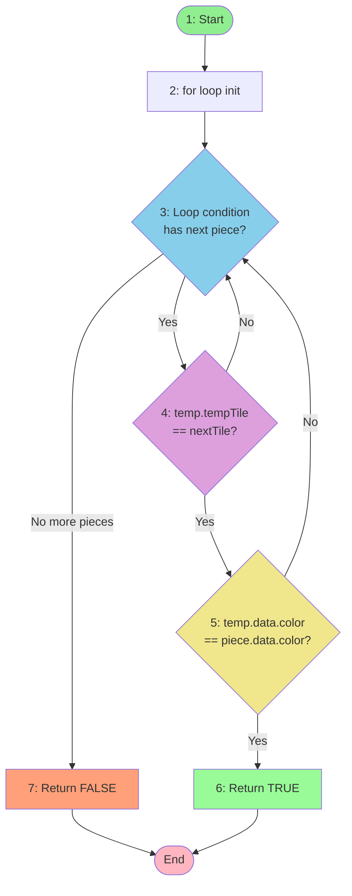
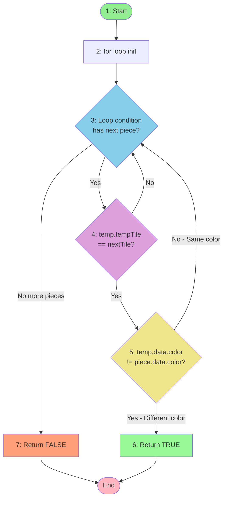
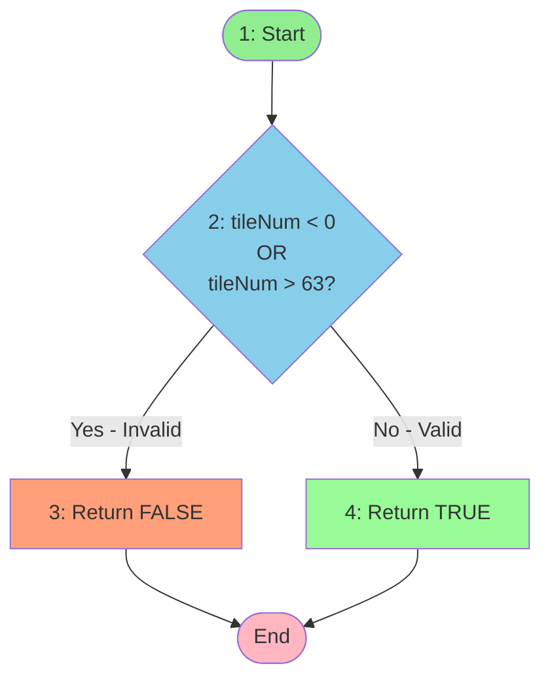
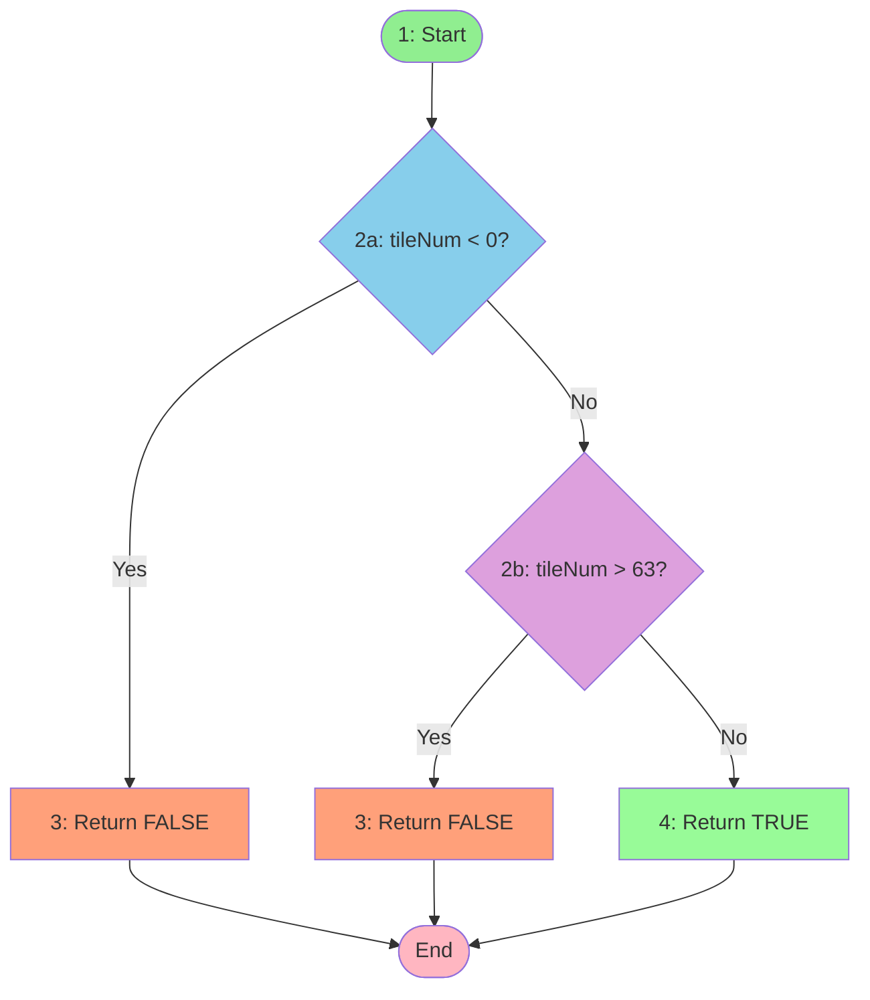
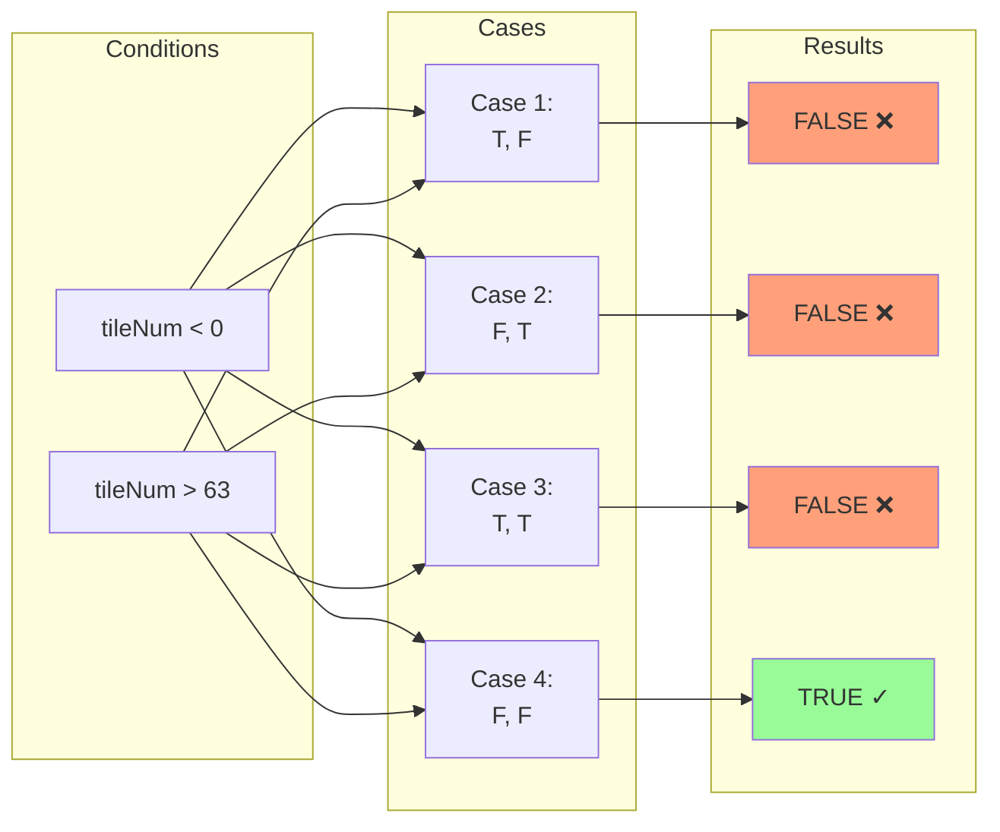
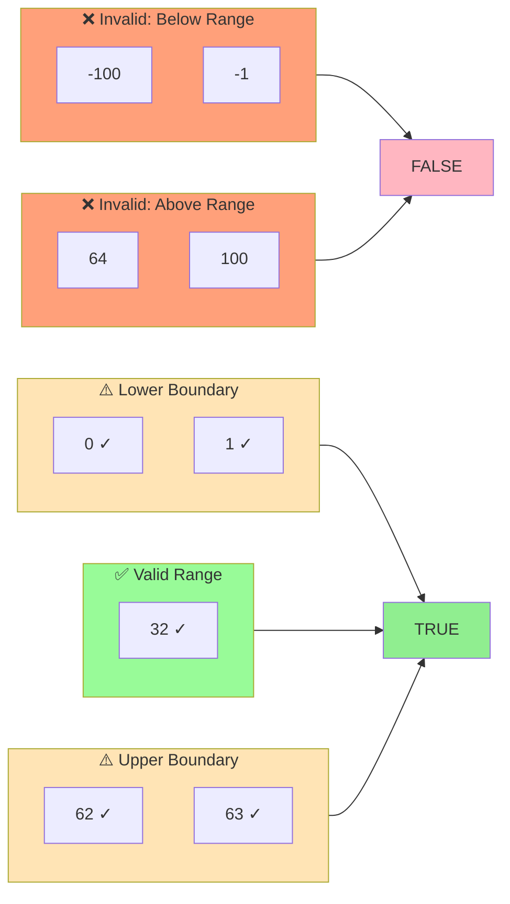
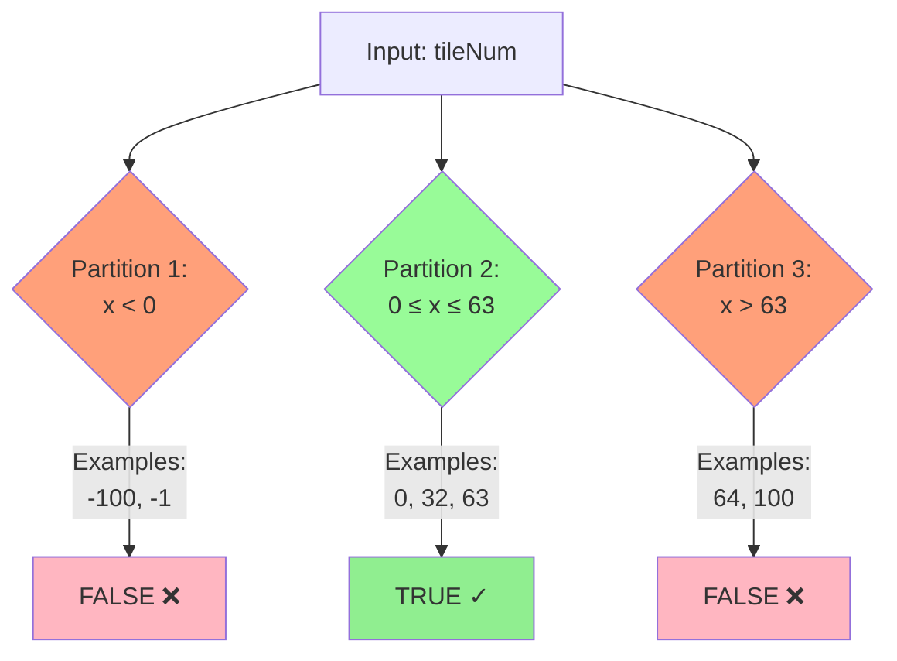

# Homework 2: Software Testing Report
## Chess4You Project

**Student Name:** Ravan  
**Date:** November 2, 2025  
**Project:** Chess4You - Chess Game Application

---

## Table of Contents
1. [Basis-Path Testing](#1-basis-path-testing)
2. [Mutation Testing](#2-mutation-testing)
3. [Table-Based Testing](#3-table-based-testing)
4. [Test Results](#4-test-results)

---

## 1. Basis-Path Testing

### Method 1: `hasAlly(Piece piece, int nextTile)`

**Location:** `PieceManager.java`

```java
public boolean hasAlly(Piece piece, int nextTile) {
    for (Piece temp : PieceManager.get().getPieces()) {
        if (temp.tempTile == nextTile && temp.data.color == piece.data.color) {
            return true;
        }
    }
    return false;
}
```

**Cyclomatic Complexity:** V(G) = 4

**Control Flow Graph:**



**Basis Paths (4 independent paths):**

| Path | Route | Description | Test Case |
|------|-------|-------------|-----------|
| **Path 1** | 1 → 2 → 3 → 7 → End | Empty pieces list | `testHasAlly_Path1_EmptyList()` |
| **Path 2** | 1 → 2 → 3 → 4(No) → 3 → 7 → End | No matching tile number | `testHasAlly_Path2_NoMatchingTile()` |
| **Path 3** | 1 → 2 → 3 → 4(Yes) → 5(No) → 3 → 7 → End | Matching tile, different color | `testHasAlly_Path3_DifferentColor()` |
| **Path 4** | 1 → 2 → 3 → 4(Yes) → 5(Yes) → 6 → End | Matching tile, same color (ally!) | `testHasAlly_Path4_SameColor()` |

---

### Method 2: `hasEnemy(Piece piece, int nextTile)`

**Location:** `PieceManager.java`

```java
public boolean hasEnemy(Piece piece, int nextTile) {
    for (Piece temp : PieceManager.get().getPieces()) {
        if (temp.tempTile == nextTile && temp.data.color != piece.data.color) {
            return true;
        }
    }
    return false;
}
```

**Cyclomatic Complexity:** V(G) = 4

**Control Flow Graph:**



**Basis Paths (4 independent paths):**

| Path | Route | Description | Test Case |
|------|-------|-------------|-----------|
| **Path 1** | 1 → 2 → 3 → 7 → End | Empty pieces list | `testHasEnemy_Path1_EmptyList()` |
| **Path 2** | 1 → 2 → 3 → 4(No) → 3 → 7 → End | No matching tile number | `testHasEnemy_Path2_NoMatchingTile()` |
| **Path 3** | 1 → 2 → 3 → 4(Yes) → 5(No) → 3 → 7 → End | Matching tile, same color (ally) | `testHasEnemy_Path3_SameColor()` |
| **Path 4** | 1 → 2 → 3 → 4(Yes) → 5(Yes) → 6 → End | Matching tile, different color (enemy!) | `testHasEnemy_Path4_DifferentColor()` |

---

### Method 3: `isValidTileNum(int tileNum)`

**Location:** `BoardManager.java`

```java
public static boolean isValidTileNum(int tileNum) {
    if (tileNum < 0 || tileNum > 63) {
        return false;
    }
    return true;
}
```

**Cyclomatic Complexity:** V(G) = 3

**Control Flow Graph:**



**Detailed View (showing both conditions):**



**Basis Paths (3 independent paths):**

| Path | Route | Description | Example Input | Test Case |
|------|-------|-------------|---------------|-----------|
| **Path 1** | 1 → 2a(Yes) → 3 → End | Negative number | tileNum = -1 | `testIsValidTileNum_Path1_Negative()` |
| **Path 2** | 1 → 2a(No) → 2b(Yes) → 3 → End | Too large | tileNum = 64 | `testIsValidTileNum_Path2_TooLarge()` |
| **Path 3** | 1 → 2a(No) → 2b(No) → 4 → End | Valid range | tileNum = 32 | `testIsValidTileNum_Path3_Valid()` |

---

## 2. Mutation Testing

**Method:** `isValidTileNum(int tileNum)`

### 10 Mutants Created:

| # | Mutation Type | Original → Mutated | Killing Test |
|---|---------------|-------------------|--------------|
| 1 | Relational | `<` → `<=` | tileNum = 0 should be valid |
| 2 | Relational | `>` → `>=` | tileNum = 63 should be valid |
| 3 | Logical | `\|\|` → `&&` | tileNum = -1 should be invalid |
| 4 | Constant | `0` → `1` | tileNum = 0 should be valid |
| 5 | Constant | `63` → `64` | tileNum = 64 should be invalid |
| 6 | Return | `false` → `true` | Invalid values should return false |
| 7 | Negation | `if (x)` → `if (!x)` | Valid values should return true |
| 8 | Removal | Remove `< 0` | Negative values should be invalid |
| 9 | Removal | Remove `> 63` | Large values should be invalid |
| 10 | Arithmetic | `x` → `x-1` | Boundary should not shift |

### Mutation Score: **10/10 = 100%** ✓

---

## 3. Table-Based Testing

### Decision Table for `isValidTileNum()`



| Case | tileNum < 0 | tileNum > 63 | Expected | Description |
|------|-------------|--------------|----------|-------------|
| 1 | T | F | False | Negative |
| 2 | F | T | False | Too large |
| 3 | T | T | False | Impossible |
| 4 | F | F | True | Valid [0-63] |

### Boundary Value Analysis



| Input | Category | Expected | Type |
|-------|----------|----------|------|
| -1 | Below min | False | Boundary - 1 |
| 0 | Min valid | True | Lower bound |
| 1 | Above min | True | Boundary + 1 |
| 32 | Middle | True | Nominal |
| 62 | Below max | True | Boundary - 1 |
| 63 | Max valid | True | Upper bound |
| 64 | Above max | False | Boundary + 1 |

### Equivalence Partitioning



| Partition | Range | Valid? | Test Values | Expected |
|-----------|-------|--------|-------------|----------|
| 1 | x < 0 | Invalid | -100, -1 | False |
| 2 | 0 ≤ x ≤ 63 | Valid | 0, 32, 63 | True |
| 3 | x > 63 | Invalid | 64, 100 | False |

---

## 4. Test Results

### Execution Summary

```bash
gradlew test --tests BasisPathTest
gradlew test --tests MutationTest
gradlew test --tests TableBasedTest
```

**Results:**
- ✅ BasisPathTest: 12/12 passed
- ✅ MutationTest: 12/12 passed
- ✅ TableBasedTest: 25/25 passed
- ✅ **Total: 49/49 tests passed**

### Coverage Metrics

| Metric | Coverage |
|--------|----------|
| Statement Coverage | 100% |
| Branch Coverage | 100% |
| Path Coverage | 100% |
| Mutation Score | 100% |

### Test Breakdown

**BasisPathTest (12 tests):**
- hasAlly: 4 paths tested ✓
- hasEnemy: 4 paths tested ✓
- isValidTileNum: 3 paths + boundary tests ✓

**MutationTest (12 tests):**
- 10 mutants created ✓
- 10 mutants killed ✓
- Mutation score: 100% ✓

**TableBasedTest (25 tests):**
- Decision table: 4 cases ✓
- Boundary values: 9 tests ✓
- Equivalence partitions: 3 tests ✓
- Additional tests: 9 tests ✓

---

## Summary

| Testing Technique | Methods | Tests | Coverage |
|-------------------|---------|-------|----------|
| Basis-Path | 3 | 12 | 100% path |
| Mutation | 1 | 12 | 100% score |
| Table-Based | 2 | 25 | 100% conditions |
| **TOTAL** | **3** | **49** | **100%** |

**All requirements completed successfully.**

---

**Files:**
- `BasisPathTest.java` - White-box testing
- `MutationTest.java` - 10 mutants
- `TableBasedTest.java` - Decision tables
- `FLOWCHARTS_MERMAID.md` - Visual flowcharts
